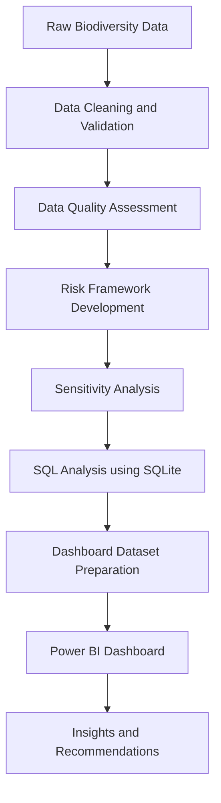
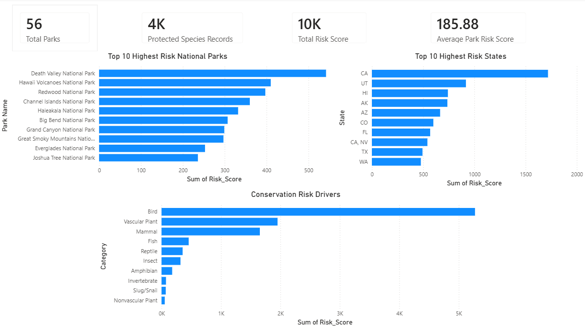
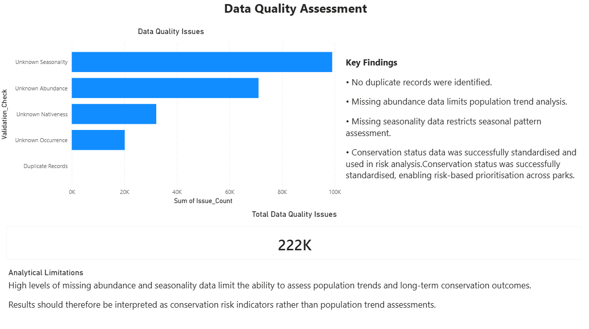

# Conservation_Performance_Dashboard

## Project Overview

This project analyses biodiversity and protected species records across United States National Parks to identify conservation risk hotspots, assess key risk drivers, and evaluate data quality issues that may affect conservation reporting and decision-making.

Using Python, SQL, SQLite, and Power BI, the project demonstrates a complete analytical workflow including data validation, data quality assessment, risk modelling, dashboard development, and insight generation.

The project was developed to simulate a real-world conservation performance reporting scenario where analysts must transform large environmental datasets into meaningful and actionable information.

---

## Business Problem

Conservation organisations often collect large volumes of biodiversity data across multiple parks and protected areas.

However, incomplete records, inconsistent classifications, and varying conservation statuses can make it difficult to:

- Identify high-risk conservation areas
- Prioritise conservation efforts
- Understand major conservation risk drivers
- Assess the reliability of analytical findings

This project develops a structured conservation risk framework and reporting dashboard to support evidence-based environmental decision-making.

---

## Project Workflow



## Data Quality Assessment

## Data Quality Assessment

Data quality was assessed before analysis to ensure analytical reliability.

The following checks were performed:

- Duplicate record detection
- Conservation status validation
- Unknown abundance assessment
- Unknown seasonality assessment
- Unknown occurrence assessment
- Unknown nativeness assessment

### Key Data Quality Findings

| Issue | Records |
|---------|---------:|
| Unknown Seasonality | 97,606 |
| Unknown Abundance | 71,061 |
| Unknown Nativeness | 32,050 |
| Unknown Occurrence | 20,048 |
| Duplicate Records | 0 |

### Analytical Limitations

The high proportion of missing abundance and seasonality data limits the ability to assess long-term population trends.

Results should therefore be interpreted as conservation risk indicators rather than population trend assessments.

---

## Conservation Risk Framework

A weighted conservation risk framework was developed using conservation status classifications.

| Conservation Status | Weight |
|---------------------|---------|
| Endangered | 5 |
| Threatened | 4 |
| Proposed Endangered | 4 |
| Proposed Threatened | 3 |
| Species of Concern | 2 |
| In Recovery | 1 |
| Under Review | 1 |
| No Special Status | 0 |

The framework enabled conservation records to be prioritised and compared across parks, states, and species categories.

### Sensitivity Analysis

To assess the robustness of the framework, an alternative weighting model was developed that placed greater emphasis on critically threatened species.

Park rankings were recalculated under both models and compared. Results showed that the highest-risk parks remained consistently ranked among the top priority locations, indicating that conservation risk prioritisation was reasonably stable under different weighting assumptions.
---

## Key Findings

### Highest Risk National Parks

| National Park | Risk Score |
|---------------|-----------:|
| Death Valley National Park | 542 |
| Hawaii Volcanoes National Park | 410 |
| Redwood National Park | 397 |
| Channel Islands National Park | 360 |
| Haleakala National Park | 332 |

### Highest Risk States

| State | Risk Score |
|--------|-----------:|
| California (CA) | 1719 |
| Utah (UT) | 918 |
| Hawaii (HI) | 742 |
| Alaska (AK) | 737 |
| Arizona (AZ) | 666 |

### Main Conservation Risk Drivers

The largest contributors to overall conservation risk were:

1. Birds
2. Vascular Plants
3. Mammals

These categories accounted for the majority of high-risk conservation records across the national park system.

---

## Dashboard Preview

### Conservation Risk Overview



### Data Quality Assessment



---

## Technical Skills Demonstrated

### Data Analysis

- Data profiling
- Data validation
- Data reconciliation
- Risk analysis
- Data quality assessment

### SQL & Database

- SQLite database design
- Aggregation queries
- Joins
- Grouping and summarisation
- Risk score calculations

### Power BI

- KPI reporting
- Dashboard design
- Visual analytics
- Insight communication

### Python

- Pandas
- Data cleaning
- Data transformation
- Workflow automation

---

## Repository Structure

```text
Conservation_Performance_Dashboard
│
├── database/
├── notebooks/
├── power_bi/
├── processed/
├── screenshots/
├── sql/
└── README.md
```

---

## Data Source

Dataset obtained from Kaggle:

Park Biodiversity Dataset

https://www.kaggle.com/datasets/nationalparkservice/park-biodiversity

---

## Project Outcome

This project demonstrates how conservation data can be transformed into actionable performance insights through data quality assessment, risk prioritisation, SQL analysis, and dashboard reporting.

The workflow reflects common analytical activities performed in performance analysis, environmental reporting, business intelligence, and operational decision-support roles.

